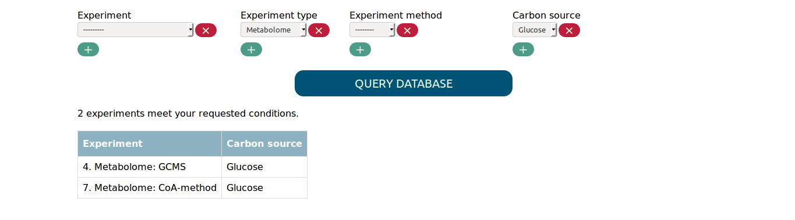
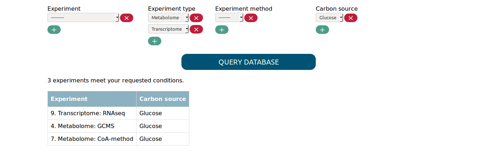
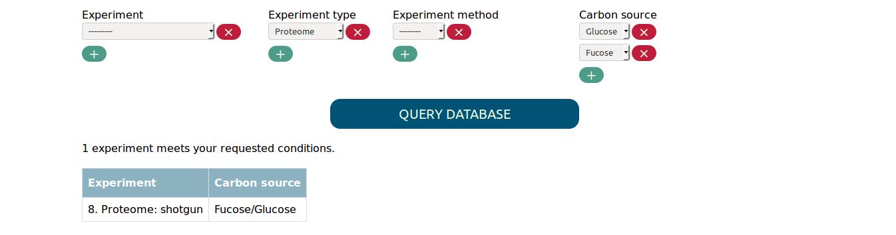
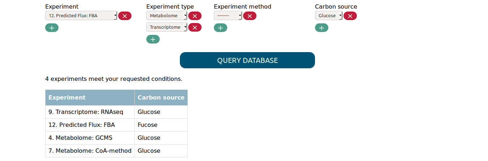
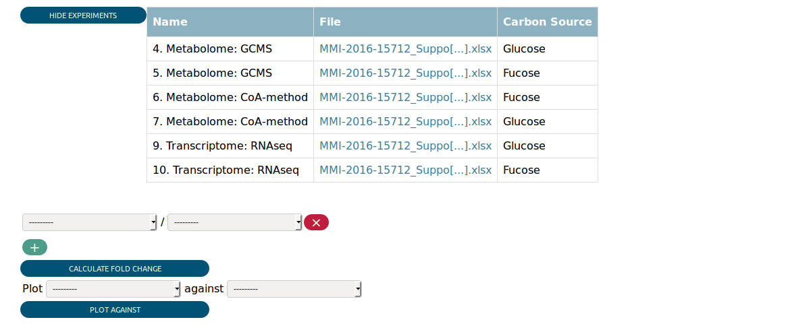
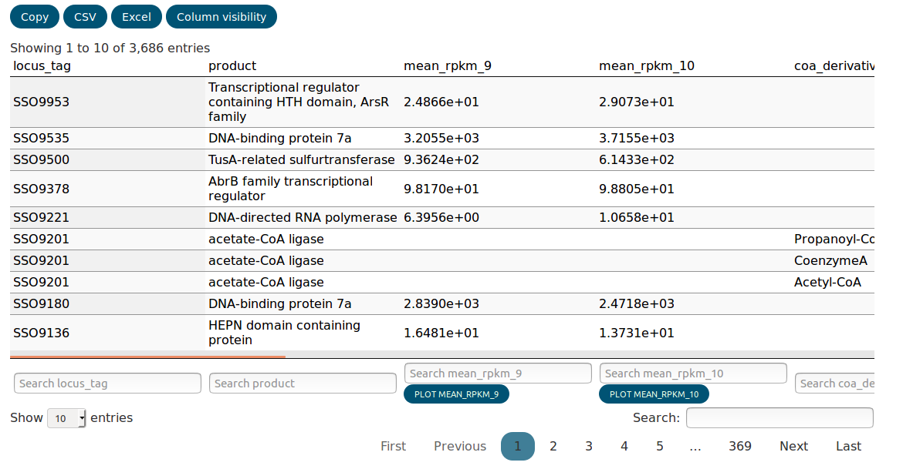
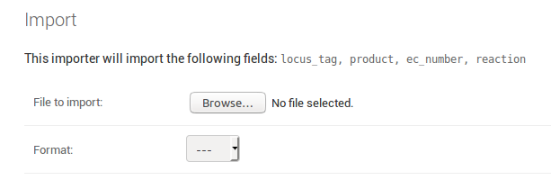
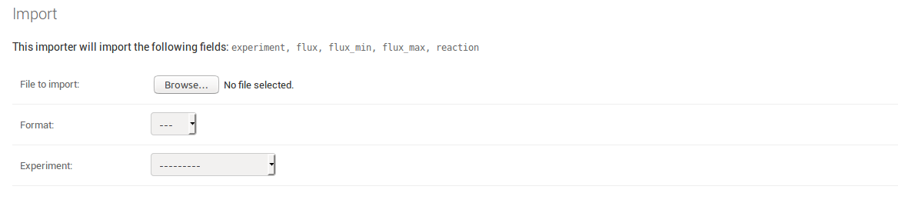

=====================
Using the Filter View
=====================

The Filter View provides you with an interface to find the experiments
you're interested in based on experimental conditions. This way you
can choose your experiments of interest, before you actually
query the database for the experimental data.

You find a select widget for each experimental parameter. Whenever
you change the options you selected, the table summarizing the matched
experiments will be updated. For example, if you want all
metabolome experiments with carbon source glucose, you will get the 
following result.

If you are interested in more than one value for the same parameter,
you can simply add another select box using the ``+`` button. This way
you can for example find all metabolome and transcriptome experiments in 
which glucose was used as carbon source.

Note that multiple values for the same parameter are connected by
a logical ``OR`` and values for different parameters are connected
by a logical ``AND`` when looking for matching experiments. The above
input, for example, would be equivalent to the expression:

.. code-block:: none

    Experiments with (type metabolome OR type transcriptome) AND carbon source glucose

In order to find experiments that compare two conditions you need to
select both values in the respective parameter. For example, to find
the proteome experiment that compares fucose to glucose as carbon source
you need to select the following:

Selecting only fucose or glucose as carbon source would not match the experiment.

Finally, you have the option to directly select experiments with the 
experiment tab. Experiments select in this tab get added to the set
of matched experiments, regardless of the other selected parameters.
This way you can, for example, add a single flux simulation that
uses fucose as carbon source to the transcriptome and metabolome experiments
that use glucose. Adding only a single experiments would be otherwise
difficult if there are many flux experiments that use fucose.

Once you are satisfied with the matched experiments you can click
"QUERY DATABASE", which will take you to the Data View.

===================
Using the Data View
===================

Assuming you selected all transcriptome and metabolome experiments
with glucose or fucose as carbon source, you would be presented the 
following in the Data View.

At the top you see a table summarizing the matched experiments again.
Then you can see some widgets that allow you to perform
some preliminary analysis. We return to them later.

Farther down on the page is the *data table* that contains the
actual integrated experimental data. The biological index, i.e. the
biological objects the data map to, always precedes the numerical data
for every type of experiment. Every column is suffixed with the
id of the experiments it belongs to. The data is integrated in the way that
loci and metabolites that are related to each other (e.g. by the encoded
enzymes) appear in the same row. This leads of course to partial duplication
of data if one locus is related to many metabolites.

The data table is searchable and columns can be completely hidden 
using the ``Column visisbility`` tab. The data can also be copied to 
the clipboard or exported as CSV or Excel. Hidden columns and 
data that was filtered out with the search will not be exported.  

The distribution of every column can be plotted as a histogram
using the button at the bottom of the column.
To plot a scatter plot comparing two experiments, the widget above 
the table can be used. The generated plots will be appended to the 
bottom of the page. You can remove them again simply by clicking on them.

Fold changes can be calculated and added to the table using
the other widget above the table. If you are interested in multiple
fold changes at the same time you can add more rows for specifying
the experiments to be compared.

=========================
Using the Admin interface
=========================
 
The Admin interface presents you a page for each :class:`Model`
that contains data in the database. You can browse the entries, add new
ones or change existing ones using simple forms.

For uploading larger datasets, the Admin interface (or short Admin)
is equipped with support for spreadsheet upload.

Uploading data for BiologicalModels
-----------------------------------

When you go the the `IMPORT` tab on a model's page
you are prompted to upload a file and specify the file format.
The page also shows you the fields that will be imported. For an
exemplary :class:`Locus` model the page could look like this:

The required fields must be included as column in the spreadsheet file 
you upload. As one locus can be related to many reaction, all related
reaction must be present in the *reaction* column, separated by commas.
A valid for uploading :class:`Locus` data could look like this:

    *Exemplary table for the data upload to the Locus model (data from Sulfolobus solfataricus).*
    
+------------+-----------------------------------------------+------------+--------------------------------------------------------------------------------------------------+
| locus_tag  |  product                                      | ec_number  | reaction                                                                                         |
+============+===============================================+============+==================================================================================================+
| SSO0299    | transketolase                                 | 2.2.1.1    | carb_ppp_2TRANSKETO-RXN,carb_ppp_2.2.1.1_1TRANSKETO-RXN,cof_thiamin_plp_2.2.1.7_DXS-RXN          |
+------------+-----------------------------------------------+------------+--------------------------------------------------------------------------------------------------+
| SSO0302    | Chorismate mutase                             | 5.4.99.5   | aa_tyr_PREPHENATEDEHYDROG-RXN                                                                    |
+------------+-----------------------------------------------+------------+--------------------------------------------------------------------------------------------------+
| SSO0304    | 3-deoxy-7- phosphoheptulonate synthase        | 2.5.1.54   | aa_phe_tyr_trp_shiki_DAHPSYN-RXN                                                                 |
+------------+-----------------------------------------------+------------+--------------------------------------------------------------------------------------------------+
| SSO0305    | 3-dehydroquinate synthase                     | 4.2.3.4    | aa_phe_tyr_trp_shiki_3-DEHYDROQUINATE-SYNTHASE-RXN                                               |
+------------+-----------------------------------------------+------------+--------------------------------------------------------------------------------------------------+
| SSO0306    | shikimate dehydrogenase                       | 1.1.1.25   | aa_phe_tyr_trp_shik_RXN-7968_NADP                                                                |
+------------+-----------------------------------------------+------------+--------------------------------------------------------------------------------------------------+
| SSO0307    | chorismate synthase                           | 4.2.3.5    | aa_phe_tyr_trp_shiki_CHORISMATE-SYNTHASE-RXN                                                     |
+------------+-----------------------------------------------+------------+--------------------------------------------------------------------------------------------------+
| SSO0308    | shikimate kinase                              | 2.7.1.71   | aa_phe_tyr_trp_shiki_SHIKIMATE-KINASE-RXN                                                        |
+------------+-----------------------------------------------+------------+--------------------------------------------------------------------------------------------------+
| SSO0309    | 3-phosphoshikimate 1-carboxyvinyl transferase | 2.5.1.19   | aa_phe_tyr_trp_shiki_2.5.1.19-RXN                                                                |
+------------+-----------------------------------------------+------------+--------------------------------------------------------------------------------------------------+
| SSO0311    | 3-dehydroquinate dehydratase                  | 4.2.1.10   | aa_phe_tyr_trp_shiki_3-DEHYDROQUINATE-DEHYDRATASE-RXN                                            |
+------------+-----------------------------------------------+------------+--------------------------------------------------------------------------------------------------+

    
Note that the first row contains two entries for reaction. 

    
Uploading data for MeasurementModels
------------------------------------

Uploading actual experimental data follows the same principle as 
uploading biological data. The only difference is that you need to choose
the experiment the data belongs to at the moment you upload it. Therefore
you do not need to include an *experiment* column in your spreadsheet,
even though it is listed as a field that is going to be imported.

Whenever your uploaded data does not make it through the validation
process, you will be informed about what went wrong in which row of 
the dataset. This helps to ensure that the data stored in the database
remains consistent. 

